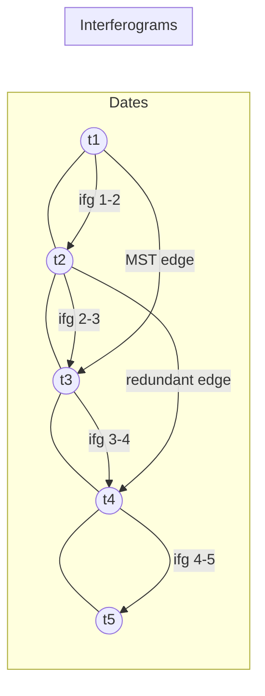

# End-to-end Sentinel‑1 TOPS InSAR stack processing from SLCs to deformation time series with ISCE2 and MintPy

## Executive summary

A robust Sentinel‑1 IW TOPS time‑series pipeline has three “critical control points”: (i) **pair/network design** (PS vs SBAS assumptions and redundancy), (ii) **TOPS coregistration accuracy** (TOPS needs ~0.001 pixel azimuth accuracy; otherwise you get burst‑edge phase ramps/jumps), and (iii) **time‑series inversion + corrections** (network inversion, troposphere, DEM residual, and ramps, referenced consistently). citeturn18view0turn21view0turn31view4turn3view3

In practice, the most reproducible approach for most deformation projects (subsidence, volcanic inflation/deflation, slow landslides) is:  
1) Use **ISCE2 topsStack (stackSentinel.py)** to generate a **coregistered SLC stack + interferogram stack** with **NESD/ESD** refinement and merged products (unwrapped phase + coherence + connected components). citeturn4view1turn4view6turn12view1  
2) Use **MintPy smallbaselineApp.py** to build or refine the interferogram network (baseline + coherence + MST safeguards), invert to time series with weighted least squares / min-norm options, then apply tropospheric/DEM/ramp corrections and export velocity/time‑series products. citeturn3view3turn21view0turn31view4turn29view0

PSI (permanent scatterers) and SBAS (small baseline subsets) are different philosophies: PSI relies on **stable point scatterers** (often full resolution, amplitude‑stability preselection), while SBAS is typically **multi‑looked distributed scatterers** with small‑baseline networks and robust inversion. MintPy’s core workflow is SBAS‑style, but you can implement **PS‑like masking/selection** (amplitude dispersion + high temporal coherence) when your scene supports it. citeturn23view2turn22view0turn13search14turn21view0

## Inputs, prerequisites, and design decisions

### Required inputs and what each is used for

**Sentinel‑1 SLCs (IW TOPS, same track/frame/AOI)**  
These provide complex SAR phase and amplitude for interferometry. In TOPS, interferometric operations must respect burst structure and Doppler variation. citeturn18view0turn5search2

**Orbit files (RESORB/POEORB)**
Precise orbits reduce geometric coregistration errors and baseline errors; POEORB supersedes RESORB when available (timeliness ~20 days) and has tighter accuracy requirements than restituted orbits. citeturn28view0turn28view1

**DEM referenced to WGS84**
Used for range‑Doppler geolocation (geo2rdr/topo), topographic phase simulation/removal, and geometric offsets prediction. ISCE2 provides `dem.py` utilities and topsStack expects WGS84 DEMs. citeturn4view1turn12view1

**AOI / processing bounding box**
For Sentinel‑1, it is strongly recommended to set an explicit processing bounding box (and often download a slightly larger area than you ultimately analyze), because the common overlap among acquisitions and burst validity can vary. citeturn4view1turn14view0

**Tropospheric delay data (optional but recommended)**
Two common families:
- **Global atmospheric reanalysis / models** (e.g., the stratified component computed from global meteorological models) citeturn6search1turn6search29  
- **GACOS** delay maps based on iterative decomposition of weather model + GNSS ZTD information citeturn6search6turn6search14  

MintPy supports stratified tropospheric correction using global atmospheric models or other approaches within `smallbaselineApp.py`. citeturn3view3turn21view0

### Compute and data-volume expectations

ISCE2 topsStack processing is I/O heavy; you should plan for large scratch space and careful parallelization of run files (ISCE2 includes a `run.py` helper with parallel options). citeturn14view0

### TOPS-specific constraint you must design around: azimuth coregistration accuracy

TOPS is much more sensitive to misregistration than stripmap. A small azimuth misregistration yields an azimuth phase ramp; to limit the ramp to ~1/100 cycle (~3.6°), an azimuth coregistration accuracy of ~0.0009 pixels is required (order 10⁻³ pixel). citeturn18view0  
This requirement drives your choice of ESD/NESD steps in ISCE2 topsStack. citeturn4view1turn4view6

## Pair selection and network design for PS versus SBAS

### Conceptual differences that affect how you select pairs

| Aspect | PSI / PS (Permanent Scatterers) | SBAS / DS (Small Baseline / Distributed Scatterers) |
|---|---|---|
| Primary measurement pixels | Stable, point-like scatterers (often urban/infrastructure) identified from temporal stability (e.g., amplitude dispersion) | Multi-looked distributed scatterers; selection guided by coherence and network invertibility |
| Typical spatial resolution | Often near full resolution (or lightly multi-looked) | Frequently multi-looked (reduced noise, improved unwrap) |
| Pair selection philosophy | Often uses a single master or carefully chosen network to preserve point stability and phase model assumptions | Uses small temporal/perpendicular baselines, plus redundancy to stabilize inversion and detect unwrapping errors |
| Core selection metrics | **Amplitude dispersion index** (low is good) and phase stability metrics | Spatial coherence + **temporal coherence** after inversion as reliability |
| Strength | High precision on PS points; strong in cities | Better spatial coverage in non-urban areas; robust to decorrelation when network is redundant |
| Typical weakness | Sparse coverage in vegetated/rural areas | Needs good unwrapping and careful correction; spatial averaging reduces fine detail |

PS uses amplitude dispersion (e.g., low dispersion values like \(D_A < 0.25\) were used to select PS candidates in classic PS work). citeturn23view2  
SBAS relies heavily on coherence and often multi-looking; a concise overview contrasting PS and SBAS pixel-selection criteria is also summarized in modern open tooling descriptions. citeturn13search14turn21view0

### Practical pair/network controls in MintPy

MintPy’s `smallbaselineApp.cfg` supports **two complementary network controls**:  
1) **Rule-based constraints** on temporal baseline, perpendicular baseline, and connection count;  
2) **Data-driven pruning** using coherence/area-ratio + **minimum spanning tree (MST)** safeguards. citeturn31view4turn21view0

Key parameters (from the default template):

| Goal | MintPy parameter | Default behavior in template |
|---|---|---|
| Max temporal baseline | `mintpy.network.tempBaseMax` (days) | `no` (disabled) citeturn31view4 |
| Max perpendicular baseline | `mintpy.network.perpBaseMax` (m) | `no` (disabled) citeturn31view4 |
| Limit neighbors per acquisition | `mintpy.network.connNumMax` | `no` (disabled) citeturn31view4 |
| Coherence-based pruning | `mintpy.network.coherenceBased` | `no` by default; can be enabled citeturn31view4 |
| Min mean coherence threshold | `mintpy.network.minCoherence` | `auto` → 0.7 citeturn31view4 |
| Keep MST edges even if low coherence | `mintpy.network.keepMinSpanTree` | `auto` → yes citeturn31view4 |
| Area-ratio pruning | `mintpy.network.areaRatioBased`, `mintpy.network.minAreaRatio` | `auto` → no; minAreaRatio auto 0.75 citeturn31view4 |

MintPy’s paper explicitly recommends **relatively relaxed interferogram selection thresholds** when you can afford more redundancy, because redundancy improves robustness and supports unwrapping‑error mitigation (phase closure / weighting). citeturn20view2turn21view0

### Mermaid diagrams (workflow + network topology)

```mermaid
flowchart TD
  A[SLC stack + orbit + DEM] --> B[TOPS coregistration\n(coarse geometry + ESD/NESD)]
  B --> C[Interferogram formation\n(topophase removed)]
  C --> D[Multilook + filter]
  D --> E[Unwrap + conncomp]
  E --> F[MintPy load_data\n(ifgramStack + geometry)]
  F --> G[Network modify\n(baseline + coherence + MST)]
  G --> H[Network inversion\n(WLS / min-norm)]
  H --> I[Corrections\n(tropo, DEM residual, ramps, ionosphere)]
  I --> J[Time series + velocity\nQC + export]
```



## ISCE2 TOPS coregistration and interferogram formation

### Recommended ISCE2 approach for Sentinel‑1 stacks: topsStack via `stackSentinel.py`

ISCE2 provides a TOPS stack workflow in `topsStack` where `stackSentinel.py` **generates run/config files**, and you execute run files sequentially. citeturn4view1turn4view6  
Inputs include the SLC directory, orbit directory (missing orbits can be downloaded), auxiliary data directory, and a WGS84 DEM. citeturn4view1

A typical project pattern (conceptual):

```bash
# 0) Create project
mkdir MyProject && cd MyProject

# 1) DEM prep (example from topsStack README)
mkdir DEM && cd DEM
dem.py -a stitch -b <S> <N> <W> <E> -r -s 1 -c
cd ..

# 2) Generate run/config files for an interferogram stack (example patterns)
stackSentinel.py -s ../SLC/ -d ../DEM/<dem>.wgs84 -o ../Orbits -a ../AuxDir -b '<S N W E>' -c 2
```

The DEM download example above and the `stackSentinel.py` calling pattern are explicitly documented in the topsStack README. citeturn4view1

### TOPS coregistration: what ISCE2 is doing and why it matters

A widely used TOPS processing “recipe” is:  
1) geometric coregistration using orbit state vectors + DEM,  
2) refine residual azimuth offsets using **Enhanced Spectral Diversity (ESD)** on burst overlap regions,  
3) resample bursts and proceed to interferogram formation at burst level (respecting Doppler centroid variation). citeturn18view0turn16view1turn4view1

Key quantitative constraints and implementation details:

- **Why ESD/NESD**: TOPS azimuth coregistration must be ~10⁻³ pixel to avoid large phase ramps; the DLR TOPS paper states ~0.0009 pixel is required for a small phase ramp limit. citeturn18view0  
- **Resampling kernel**: The same paper notes interpolation/resampling of slave bursts can be performed with a **six-point cubic convolution kernel**. citeturn18view0  
- **Burst-overlap exploitation**: ESD leverages differential interferograms in burst overlap areas and is commonly used because it can outperform incoherent correlation-based shift estimation for Sentinel‑1 parameters. citeturn16view2turn16view1  
- **ISCE2 choice**: In topsStack, coregistration can be geometry-only or geometry+NESD; geometry+NESD is default, and you can tune the ESD coherence threshold and number of overlap interferograms used. citeturn4view1  

### Key run-file stages in ISCE2 topsStack and what each produces

The topsStack README describes the run files and their purpose. A condensed mapping (important for debugging):

- `run_03_extract_burst_overlaps`: extracts burst overlaps required for NESD/ESD azimuth misregistration estimation. citeturn4view0turn4view1  
- `run_05_pairs_misreg`: builds differential overlap interferograms and estimates azimuth misregistration via ESD. citeturn4view1  
- `run_06_timeseries_misreg`: estimates a time series of azimuth/range misregistration relative to the stack reference via least squares from pair misregistrations. citeturn4view1  
- `run_07_geo2rdr_resample`: computes geometrical offsets and uses misregistration time-series for precise burst coregistration/resampling. citeturn4view1  
- `run_08_extract_stack_valid_region`: tracks burst overlap validity to prevent lines of invalid data after merging. citeturn4view1  
- `run_09_merge`: merges bursts into full subswath/scene products and merges geometry rasters (lat/lon/LOS/shadow etc.). citeturn4view1turn4view0  

For an interferogram stack workflow, the README states that merged interferograms are produced and then multilooked, filtered, and unwrapped; geocoding is not automatically applied (use `geocodeGdal.py` if needed). citeturn4view6

### Running run-files efficiently (and safely)

A practical pattern used by experienced users is to run each run file through ISCE2’s `run.py`, optionally with parallelism (`-p`), but cautiously to avoid I/O overload. An example script is shown in the STEP forum discussion, including parallel settings per stage (higher for unwrapping). citeturn14view0

image_group{"layout":"carousel","aspect_ratio":"16:9","query":["Sentinel-1 IW TOPS burst overlap ESD diagram","InSAR interferogram fringes example coherence map","SNAPHU phase unwrapping connected components example"],"num_per_query":1}

## Multilooking, filtering, SNAPHU unwrapping, and QC

### Multilooking: choose looks based on TOPS sampling and unwrapping needs

For Sentinel‑1 IW TOPS, the DLR processing paper lists representative spacings: slant-range pixel spacing ~2.3 m and azimuth pixel spacing ~14.1 m (plus subswath-dependent resolutions). citeturn16view0  
This anisotropy is why many workflows apply **more range looks than azimuth looks** to approach near-square posting and suppress noise before unwrapping.

A general statistical reminder: ESA’s InSAR training material explains that coherence/phase are typically estimated using local averaging; the number of independent samples \(N\) used is often **~16 to 40**, and in low-coherence cases one may need even more averaging, at the cost of resolution. citeturn25view0

### Filtering prior to unwrapping: why it helps

NASA’s Earthdata unwrapping recipe emphasizes that, for better unwrapping performance, it is recommended to **multi‑look and phase‑filter** (increase SNR/smooth) the interferogram before unwrapping, and that reliable unwrapped results require high coherence. citeturn15view2

### SNAPHU unwrapping: models, inputs, connected components

SNAPHU is a **statistical-cost, network-flow** phase unwrapping algorithm that frames unwrapping as a MAP estimation problem and includes built-in statistical models for topography, deformation, and smooth generic data. citeturn15view0  
The SNAPHU manpage states important operational requirements:

- Range should increase to the right; remove flat-earth ramp before running. citeturn15view1  
- For deformation interferograms, topography-related phase should also be removed prior to SNAPHU. citeturn15view1  
- You can run deformation-mode using `-d` (and smooth-mode with `-s`). citeturn15view1  

Connected components matter downstream: MintPy’s template notes that connected components are required for its unwrapping-error correction options, and that SNAPHU is (as far as the template notes) the unwrapper that provides connected components in this context. citeturn31view4

### SNAPHU tiling and parallelism: practical knobs you can actually set

The SNAPHU manpage documents tile mode and multiprocessing:

- `--tile ntilerow ntilecol rowovrlp colovrlp` partitions the interferogram into overlapping tiles. citeturn15view1  
- `--nproc n` runs tiles in parallel (forking processes). citeturn15view1  
- Example usage includes running a tiled unwrap with overlap 30 pixels and 2 processors. citeturn15view1  

A realistic operational constraint: SNAPHU memory footprint is on the order of ~100 MB per 1,000,000 pixels in single-tile mode (execution time depends strongly on interferogram difficulty). citeturn15view0

### QC checkpoints you should not skip

Use these checks to avoid “pretty maps with wrong physics”:

- **Burst-edge discontinuities**: often a symptom of insufficient TOPS azimuth coregistration; revisit ESD/NESD coherence threshold and overlap strategy if seen. citeturn18view0turn4view1  
- **Network connectivity**: SNAPHU and time-series inversion both degrade badly if the interferogram network is weak or disconnected; MintPy explicitly leverages MST safeguards to keep a connected backbone. citeturn31view4turn15view1  
- **Temporal coherence vs spatial coherence**: low temporal coherence with “reasonable” spatial coherence is a classic marker of residual unwrapping errors and non-closing triplets; MintPy’s methods exist specifically to diagnose/correct these. citeturn20view2turn31view4turn21view0  

## MintPy ingestion, inversion, corrections, and post-processing

### ISCE2 → MintPy data formats and directory structure

MintPy documents a standard directory structure for ISCE2 topsStack outputs and the corresponding `load_data` template paths. Key required products include:

- Unwrapped interferograms: `merged/interferograms/<date1>_<date2>/filt_fine.unw` citeturn12view1  
- Coherence: `.../filt_fine.cor` citeturn12view1  
- Connected components: `.../filt_fine.unw.conncomp` citeturn12view1  
- Geometry rasters: `merged/geom_reference/hgt.rdr, lat.rdr, lon.rdr, los.rdr, shadowMask.rdr` citeturn12view1  
- Metadata for the stack: `reference/IW*.xml` and `reference/data.rsc` (generated by `prep_isce.py`) citeturn12view1turn10view2  
- Baseline directory: `baselines/` citeturn12view1  

MintPy’s directory-structure page also provides the corresponding template stanzas for ISCE/topsStack ingestion. citeturn12view1

`prep_isce.py` is the MintPy utility for preparing ISCE metadata files, with a documented CLI requiring dataset dir, meta file, baseline dir, and geometry dir. citeturn10view2

### MintPy end-to-end workflow entry point and what it does

MintPy’s documentation summarizes `smallbaselineApp.py` as the routine workflow that reads the stack (unwrapped interferograms, coherence, connected components) and geometry, references interferograms, estimates unwrapping errors (optional), inverts to time series, computes temporal coherence, and applies corrections (troposphere, ramps, DEM residual, etc.). citeturn3view3turn21view0

### A command-level checklist you can follow for a real project

This checklist assumes you already produced ISCE2 topsStack outputs matching the documented directory structure. citeturn12view1turn4view6

1) **Create a MintPy working directory** alongside your ISCE2 project:
```bash
mkdir -p mintpy && cd mintpy
```

2) **Generate a default template and edit it**:
```bash
smallbaselineApp.py -g
# edit smallbaselineApp.cfg (or generate a custom template)
```
`smallbaselineApp.py -g` and default-template use are documented. citeturn3view3

3) **Set ISCE2 file patterns (topsStack) in the template** (paths follow MintPy’s documented example):
```cfg
mintpy.load.processor      = isce
mintpy.load.metaFile       = ../reference/IW*.xml
mintpy.load.baselineDir    = ../baselines
mintpy.load.unwFile        = ../merged/interferograms/*/filt_*.unw
mintpy.load.corFile        = ../merged/interferograms/*/filt_*.cor
mintpy.load.connCompFile   = ../merged/interferograms/*/filt_*.unw.conncomp
mintpy.load.demFile        = ../merged/geom_reference/hgt.rdr
mintpy.load.lookupYFile    = ../merged/geom_reference/lat.rdr
mintpy.load.lookupXFile    = ../merged/geom_reference/lon.rdr
mintpy.load.incAngleFile   = ../merged/geom_reference/los.rdr
mintpy.load.azAngleFile    = ../merged/geom_reference/los.rdr
mintpy.load.shadowMaskFile = ../merged/geom_reference/shadowMask.rdr
```
These exact patterns are documented for ISCE/topsStack. citeturn12view1

4) **Define network modification rules (SBAS-style)** (examples of available knobs):
```cfg
mintpy.network.tempBaseMax = 96
mintpy.network.perpBaseMax = 150
mintpy.network.connNumMax  = 10
```
These parameters exist in the default template (disabled by default). citeturn31view4  
(Values above are example starting points; tune to your decorrelation regime and acquisition density.)

5) **Enable data-driven pruning with MST safety** (recommended for large stacks):
```cfg
mintpy.network.coherenceBased  = yes
mintpy.network.minCoherence    = 0.7
mintpy.network.keepMinSpanTree = yes
```
MintPy documents coherence-based pruning plus MST retention and notes the default minCoherence value. citeturn31view4turn5search15

6) **Set a reference point** (do not rely on “auto” unless you have no alternative):
```cfg
mintpy.reference.lalo = <lat>,<lon>
```
MintPy’s guidance: reference should be coherent, not impacted by strong atmospheric turbulence (e.g., ionospheric streaks), and at similar elevation to minimize spatially correlated atmospheric delay. citeturn21view0turn31view4

7) **Decide whether to correct unwrapping errors**
MintPy supports bridging and phase-closure strategies; which one to use depends on error distribution/network redundancy. citeturn31view4turn21view0

8) **Choose inversion weighting and temporal coherence threshold**
MintPy exposes multiple weight functions and uses temporal coherence as a reliability mask (default threshold 0.7). citeturn31view4turn20view2

9) **Run the workflow**:
```bash
smallbaselineApp.py smallbaselineApp.cfg
```
This is the documented routine workflow entry point. citeturn3view3

### Inversion math, weighting, and regularization

MintPy’s network inversion is framed as a weighted least squares (WLS) estimator. The MintPy paper presents the standard closed-form WLS solution:
\[
\hat{\phi} = (A^T W A)^{-1} A^T W \Delta \phi
\]
where \(A\) is the design matrix mapping acquisition phases to interferogram phases and \(W\) is a diagonal weight matrix. citeturn22view0

Two practical MintPy switches in the default template connect directly to SBAS-style behavior:

- `mintpy.networkInversion.weightFunc`: supports multiple weighting schemes; uniform weighting corresponds to classic SBAS assumptions, while inverse-variance weighting is recommended in the MintPy paper for robustness. citeturn31view4turn20view3  
- `mintpy.networkInversion.minNormVelocity = yes`: indicates a minimum-norm deformation velocity/phase option used in SBAS-style setups. citeturn29view4turn31view4  

Temporal coherence is computed after inversion and used to mask unreliable pixels; MintPy describes temporal coherence as a reliability measure that accounts for residuals including decorrelation and unwrapping errors (non-closing triplets). citeturn20view2turn31view4

### PS selection metrics you can apply around a MintPy workflow

Even though MintPy is SBAS‑centric, you can implement PS-like selection and interpretation using two complementary metrics:

**Amplitude dispersion index (PS candidate preselection)**  
Classic PS work computes an amplitude dispersion index and reports selecting PS candidates with low dispersion (e.g., \(D_A < 0.25\) in an example). citeturn23view2  
Practical implication: compute \(D_A = \sigma_A / \mu_A\) on an SLC amplitude stack and use it as a mask before time-series analysis on stable reflectors (especially in urban scenes).

**Temporal coherence (post-inversion reliability)**  
MintPy computes temporal coherence after network inversion and uses it for a reliability mask (default 0.7). citeturn20view2turn31view4  
In PS-like usage, you typically set a higher threshold (e.g., 0.85–0.95) to focus on very stable pixels; the MintPy reference selection logic itself uses high spatial coherence (~0.85 default) as a basis for picking a reference point when automatic selection is used. citeturn21view0turn31view4

### Corrections: troposphere, ramps, DEM residual, orbit/phase artifacts

**Tropospheric delay (APS)**
- A systematic approach is to compute stratified tropospheric delay from global atmospheric models and subtract it from interferograms/time series. This is a documented correction strategy in the geodesy literature. citeturn6search1turn6search29  
- GACOS provides tropospheric delay maps and is widely cited for generic atmospheric correction in InSAR. citeturn6search6turn6search14  
MintPy’s routine workflow explicitly supports stratified tropospheric delay correction using global atmospheric models. citeturn3view3turn21view0

**Phase ramps / orbital/timing residuals**
MintPy includes a `deramp` step to estimate and remove phase ramps per acquisition, recommended for localized deformation signals (volcanoes, landslides, subsidence) and not recommended for long-wavelength tectonic signals. citeturn29view0  
The same MintPy template sets default ramp removal options and masks for estimation. citeturn29view0turn31view4

**DEM residual (topographic residual) correction**
MintPy exposes `mintpy.topographicResidual` for DEM error correction and references established approaches for topographic residual estimation in time series. citeturn29view0turn29view2

**Ionospheric correction (where relevant)**
ISCE2 topsStack supports ionospheric phase estimation workflows; MintPy includes an ionospheric correction hook that expects split-spectrum outputs from ISCE2 stack processors. citeturn4view6turn29view4turn29view1

### Post-processing: LOS decomposition and GNSS validation

**LOS → horizontal/vertical decomposition**
MintPy includes `asc_desc2horz_vert.py`, which constructs a design matrix to map LOS displacement into horizontal/vertical components (or full ENU with multi-geometry), explicitly documenting the LOS projection equations in the code. citeturn32view0  
Operationally, this requires that ascending and descending products be co-registered in a common grid and share consistent geometry metadata. citeturn7search3

**Reference strategy for validation**
MintPy is explicit that careful reference selection (space and time) is important; the MintPy paper gives reference-point guidelines, and the default template enforces reference selection and temporal coherence masking as core QA. citeturn21view0turn20view2  
For GNSS comparison, practical best practice is to project GNSS ENU velocities/displacements into LOS and compare with InSAR outputs, ensuring both are referenced consistently (same datum/reference). MintPy’s ecosystem includes workflows and discussions around GPS/InSAR comparison usage patterns. citeturn8search1turn8search4turn8search10

image_group{"layout":"carousel","aspect_ratio":"16:9","query":["MintPy InSAR time series deformation map example","Sentinel-1 subsidence time series InSAR MintPy output","GNSS InSAR comparison plot example"],"num_per_query":1}

### Recommended primary sources to keep at hand

Foundational TOPS / coregistration:
- entity["people","Nestor Yague-Martinez","sentinel-1 tops insar"] et al., *Interferometric Processing of Sentinel‑1 TOPS Data* (TOPS coregistration accuracy requirements; ESD; burst-level processing). citeturn18view0turn16view1turn16view2  

ISCE2 workflow documentation:
- ISCE2 `topsStack` README (stackSentinel options, NESD/geometry, run-file meanings, AOI guidance). citeturn4view1turn4view6  
- ISCE2 stack processing run-file execution guidance including `run.py`. citeturn14view0  

MintPy workflow, options, and theory:
- MintPy documentation for `smallbaselineApp.py` routine workflow. citeturn3view3turn8search12  
- MintPy default template (`smallbaselineApp.cfg`) for network modification, inversion, unwrapping-error correction, deramp/topographic residual options. citeturn31view4turn29view0turn29view4  
- entity["people","Zhang Yunjun","mintpy author"] et al. (2019) MintPy paper (WLS inversion, reference selection, reliability via temporal coherence, correction workflow). citeturn22view0turn21view0turn20view2  

PSI fundamentals:
- entity["people","Alessandro Ferretti","insar ps author"], entity["people","Claudio Prati","insar researcher"], and entity["people","Fabio Rocca","insar researcher"] (2001) PS paper (amplitude dispersion index; PS candidate selection). citeturn23view2turn23view0  

Unwrapping:
- SNAPHU overview and manpage (MAP/network‑flow unwrapping; deformation mode; tiling; connected components). citeturn15view0turn15view1  

Troposphere:
- entity["people","Romain Jolivet","insar troposphere"] et al. (systematic tropospheric delay correction from global meteorological reanalysis). citeturn6search1turn6search29  
- entity["people","Chao Yu","gacos author"] et al. (2018) GACOS atmospheric correction model. citeturn6search6turn6search14  

Institutional references used in this report:
- entity["organization","European Space Agency","space agency europe"] InSAR Principles (TM‑19) for coherence/averaging guidance and general interferometric pair selection principles. citeturn25view0turn27view0turn5search4  
- entity["organization","Copernicus","eu earth observation program"] Sentinel orbit product descriptions (RESORB/POEORB accuracy). citeturn28view0  
- entity["organization","National Aeronautics and Space Administration","us space agency"] Earthdata unwrapping guidance (multilook/filter prior to SNAPHU). citeturn15view2  
- entity["organization","European Centre for Medium-Range Weather Forecasts","weather model center"] ERA5 dataset description (used widely in tropospheric corrections workflows). citeturn6search20turn6search16