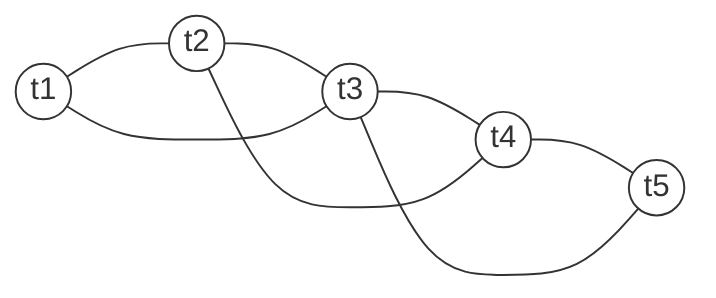

# End-to-end Sentinel‑1 TOPS InSAR stack processing from SLCs to deformation time series with ISCE2 topsStack and MintPy

## Executive summary

This report describes a complete, practical Sentinel‑1 TOPS (IW) time‑series pipeline using **ISCE2 topsStack/stackSentinel** for **TOPS‑correct coregistration + interferogram generation + (optional) filtering/unwrapping** and **MintPy** for **pair/network selection refinement, reference setting, time‑series inversion, and geophysical corrections**. It explicitly pinpoints where **coregistration**, **interferogram stacking**, **reference pixel/date**, and **corrections** occur in each toolchain. citeturn6view0turn5view3turn15search4

Key takeaways:

- Sentinel‑1 TOPS requires **extremely accurate azimuth coregistration**; a published analysis shows that to keep TOPS azimuth phase ramps to ~1/100 cycle, you need ~**0.0009 pixel** azimuth accuracy, motivating **ESD/NESD** refinement rather than “standard” patch cross‑correlation alone. citeturn23view0
- In ISCE2 topsStack, coregistration is performed **to a stack reference acquisition** (“stack reference”) and refined by **NESD/ESD**; you can control ESD via the **ESD coherence threshold (`-e`)** and the **number of overlap interferograms used (`-O`)**. citeturn6view0turn5view0
- MintPy’s routine workflow (`smallbaselineApp.py`) starts from **coregistered + unwrapped interferograms** and then (in order) **references all interferograms to a single reference pixel**, optionally checks **phase closure / unwrapping errors**, **inverts the interferogram network** using **weighted least squares**, computes **temporal coherence**, and then applies **troposphere correction**, **deramping**, and **DEM-error correction** before estimating velocity. citeturn5view3turn15search4turn13view5turn13view3turn15search3
- **Reference setting** is split:  
  - ISCE2 sets a **geometric/reference acquisition** for coregistration and topo computation (“stack reference”). citeturn29view1turn7view0  
  - MintPy should set the **reference pixel** (space) and (optionally) **reference date** (time) for the final displacement time series via `mintpy.reference.*`. citeturn14view0turn14view2turn5view3
- GNSS is best used as (a) **validation** by extracting InSAR at GNSS sites and comparing, and optionally (b) **a calibration/tie** after MintPy time series are produced, acknowledging that tying InSAR to GNSS is an active research area and should be done carefully. citeturn17view0turn16search2

Unspecified by the user (treated as **unspecified** throughout): area of interest (AOI), orbit direction(s) (ascending/descending), number of acquisitions, landcover/decorrelation regime, GNSS density and sampling, and whether the target deformation is localized (subsidence/volcano/landslide) or long-wavelength (tectonics). Where these matter, recommended alternatives are provided. citeturn5view3turn21search7turn23view0

## Pipeline architecture and where each operation happens

### Inputs required and what they control

- **Sentinel‑1 IW SLC SAFE products**: complex data needed for interferometry. TOPS requires burst-level handling due to Doppler centroid variation; interferometric operations (resampling, spectral-shift filtering) should be performed at burst level. citeturn23view0turn21search0  
- **Orbit files** (RESORB/POEORB): improve geometry, baseline, and coregistration; an orbit registry summarizes that RESORB are rapid/timely and POEORB are more precise, and the TOPS processing paper quantifies accuracy requirements (restituted vs precise). citeturn21search5turn23view0  
- **DEM** in WGS84 horizontal and typically WGS84/ellipsoid vertical datum for ISCE2 workflows: required for geometric coregistration, topo phase simulation/removal, and radar-to-geo mapping. citeturn6view0turn21search14turn23view0  
- **AOI bounds**: used to constrain processing in ISCE2 (`-b 'S N W E'`) and to ensure consistent extents; MintPy requires all interferograms/geometry layers to share the same spatial extent/resolution. citeturn7view0turn16search6turn9view0  
- **Tropospheric data** (optional but recommended): either (i) global atmospheric models via PyAPS in MintPy or (ii) external delay maps like GACOS; these reduce stratified atmospheric signals that alias into deformation. citeturn13view5turn28search0turn28search1  
- **GNSS time series** (optional but recommended): used to validate, and optionally to tie the InSAR solution to an external reference frame after time-series estimation. citeturn17view0turn16search16turn16search14  

### Responsibility split between ISCE2 and MintPy

| Stage | Happens in ISCE2 topsStack / stackSentinel | Happens in MintPy | Notes |
|---|---|---|---|
| Choose stack reference acquisition (“master” for geometry/coreg) | Yes (internal “stack reference”; topo run once for reference) citeturn29view1turn7view0 | No | This is **not** the same as the final deformation reference date. citeturn14view2turn5view3 |
| TOPS burst alignment + azimuth refinement (ESD/NESD) | Yes (NESD default; tunable `-e` and `-O`) citeturn6view0turn29view1turn23view0 | No | Critical TOPS requirement (~0.0009 px) motivates ESD/NESD. citeturn23view0 |
| Differential interferogram formation (flat-earth/topo removal) | Yes (burst interferograms formed and merged; topo computed from DEM; differential processing described in TOPS flow) citeturn7view0turn23view0 | No (expects unwrapped stack) citeturn5view3turn16search6 | SNAPHU expects flat-earth removed; for deformation, topo removed too. citeturn10view0 |
| Filtering, multilooking, unwrapping, conncomp | ISCE2 can do this in interferogram workflow; outputs include filtered unwrapped phase and conncomp in expected dirs citeturn7view0turn9view0 | MintPy can **correct** residual unwrap errors but assumes unwrapped input citeturn5view3turn15search4turn14view0 | MintPy’s unwrapping-error correction uses conncomp. citeturn14view0turn22search3 |
| Network pruning/selection refinement | Limited (stackSentinel can generate nearest-neighbor pairs with `-c`) citeturn7view0 | Yes (`modify_network`: thresholds + coherence + MST) citeturn0search5turn13view0 | A common strategy: build a reasonable set in ISCE2, refine in MintPy. citeturn13view0turn15search4 |
| Reference pixel (space) | No | Yes (`mintpy.reference.yx` or `mintpy.reference.lalo`) citeturn14view0turn5view3 | This is where you anchor “zero” deformation spatially. citeturn17view0 |
| Reference date (time) | No | Yes (`mintpy.reference.date` / `reference_date.py`) citeturn14view2turn30search2 | Often the first date unless changed. citeturn14view2turn5view1 |
| Time-series inversion + weighting + min-norm options | No | Yes (WLS inversion; SBAS-style min-norm option) citeturn15search4turn13view0turn27view0 | MintPy explicitly links SBAS (Berardino 2002) to min-norm+weight settings. citeturn13view0turn27view0 |
| Troposphere/deramp/DEM residual corrections | No (except optional ionosphere products in ISCE2) citeturn6view3 | Yes (pyaps/height-correlation/gacos; deramp; DEM residual) citeturn13view5turn13view3turn13view4turn15search3turn28search0turn28search1 | MintPy documents correction order in `smallbaselineApp`. citeturn5view3turn5view4 |
| GNSS tie-in | Not standard | Not standard in inversion; usually post-processing calibration/validation | Recommended: validate by comparing at GNSS sites; tie cautiously post-hoc. citeturn17view0turn16search16turn16search14 |

### Mermaid overview diagram

```mermaid
flowchart TD
  A[Inputs: Sentinel-1 SLCs + orbits + DEM + AOI] --> B[ISCE2 topsStack/stackSentinel\nGenerate run_files + configs]
  B --> C[TOPS coregistration to stack reference\nGeometry + NESD/ESD refinement]
  C --> D[Interferogram stack\nburst-level ifg -> merge]
  D --> E[Multilook/filter/unwrap\nOutput: filt_fine.unw + coherence + conncomp]
  E --> F[MintPy load_data\nifgramStack.h5 + geometryRadar.h5]
  F --> G[MintPy reference pixel/date\nmintpy.reference.*]
  G --> H[modify_network\nthresholds + coherence + MST]
  H --> I[invert_network\nWLS + min-norm option]
  I --> J[Corrections\n(tropo, deramp, DEM residual, optional ionosphere)]
  J --> K[Products\nvelocity.h5 + timeseries*.h5 + QC layers]
  K --> L[Post-processing\nasc/desc decomposition + GNSS validation/tie]
```

## Pair selection and SBAS vs PS-like workflows

### SBAS and PS: conceptual comparison (implementation-focused)

| Attribute | SBAS (Small Baseline Subset) | PS / PSI (Permanent Scatterers) | Practical implication in ISCE2+MintPy |
|---|---|---|---|
| Pair selection | Select pairs with **small temporal + perpendicular baselines** to limit decorrelation and phase unwrapping problems citeturn27view0turn20search10turn20search0 | Often uses a single-master or constrained network; relies on identifying **phase-stable pixels** and modeling atmospheric/orbital terms citeturn26view0 | In ISCE2, you can build a nearest-neighbor SBAS-like network (`-c 2`), then refine in MintPy. citeturn7view0turn13view0 |
| Pixel strategy | Distributed scatterers; frequently multilooked and coherence-masked citeturn21search7turn13view0turn15search4 | Point-like stable scatterers preselected by amplitude dispersion and refined by phase stability (temporal coherence/APS removal) citeturn26view0 | MintPy is SBAS-centric but supports PS-like **masking** using amplitude dispersion (external) + high temporal coherence (internal). citeturn14view0turn13view2turn26view0 |
| Inversion regularization | Often **minimum-norm** solutions when the network is rank-deficient or to link subsets; SBAS literature uses SVD linking of datasets citeturn27view0turn20search10turn3search15 | PS approaches solve a parameterized model per PS and separate APS/orbit terms; large baselines can be used on sparse stable points citeturn26view0 | MintPy exposes SBAS-style min-norm and WLS weighting options explicitly in its config. citeturn13view0turn15search4 |
| Best scenes | Vegetation-free/slow decorrelation or with short repeats; broad-area deformation citeturn20search10turn21search7 | Urban/infrastructure/rocky terrain with stable reflectors citeturn26view0 | Choose SBAS defaults first unless you know you have strong PS density. citeturn26view0turn15search4 |

### Network construction: what “good” means

A time-series network should be **connected** (all dates solvable), and preferably **redundant** (triangles) so you can detect/correct unwrapping errors via phase closure. MintPy’s workflow explicitly uses phase closure diagnostics and offers unwrapping-error correction methods (bridging, phase closure) that benefit from redundancy. citeturn5view3turn22search3turn14view0

MintPy also protects connectivity with a **minimum spanning tree (MST)** option when pruning by coherence/thresholds. citeturn0search5turn13view0



### Table C: Pair-selection thresholds for different landcover

These are **starting points**, not universal constants. They reflect (i) SBAS principles (small temporal/spatial baselines) and (ii) published example thresholds used in vegetation-focused and subsidence-focused Sentinel‑1 SBAS studies, plus guidance that short repeats improve coherence in rugged/icy terrain. citeturn27view0turn4search3turn3search14turn4search4

| Landcover regime (unspecified AOI) | Typical decorrelation behavior | Suggested SBAS thresholds (start) | Supporting examples / notes |
|---|---|---|---|
| Urban / built-up | High PS density; coherence often persists over longer Δt | Δt ≤ 180 days; |B⊥| ≤ 150–300 m | Community MintPy examples often start around 150 m / 180 d (tune). citeturn3search6turn13view0 |
| Vegetated / agricultural | Rapid temporal decorrelation | Δt ≤ 24–48 days; |B⊥| ≤ 50–150 m | A vegetation–coherence study reports using 24 days temporal and 100 m perpendicular thresholds for pairs. citeturn4search3 |
| Wetlands / very dynamic surfaces | Very rapid temporal changes, low coherence | Δt as short as possible (6–24 days); restrict |B⊥| conservatively | Small-temporal-baseline approaches exist specifically for wetlands because standard SBAS suffers decorrelation. citeturn3search1 |
| Ice / high mountains | Variable; often low coherence except short repeats/cold seasons | Use shortest repeats available (6–12 days) and tight |B⊥|; consider offset-tracking if phase decorrelates | A Himalaya-focused assessment notes improved coherence with 6‑day temporal baseline from Sentinel‑1 constellation. citeturn4search4 |

For rigorous projects, consider systematic pair selection optimization (coherence-proxy + network constraints) rather than only Δt/B⊥ thresholds. citeturn3search0turn4search11

## ISCE2 topsStack with stackSentinel: TOPS coregistration, interferograms, filtering, and SNAPHU unwrapping

image_group{"layout":"carousel","aspect_ratio":"16:9","query":["Sentinel-1 TOPS burst overlap interferometry ESD","Sentinel-1 TOPS azimuth phase ramp burst seam","ISCE2 topsStack Sentinel-1 interferograms filt_fine.unw coherence","SNAPHU phase unwrapping tile mode connected components"],"num_per_query":1}

### Command-level setup and required folder layout

ISCE2’s topsStack stack processor is distributed in `contrib/stack/topsStack` and should be added to `$PATH` so you can run `stackSentinel.py`. citeturn6view0turn29view0

At minimum, `stackSentinel.py` requires:  
- `-s` SLC directory, `-o` orbit directory (missing orbits can be downloaded automatically), `-a` auxiliary directory, `-d` WGS84 DEM. citeturn6view0turn7view0

Example skeleton (placeholders are **unspecified** AOI bounds and directories):

```bash
# Project root
mkdir -p Project/SLC Project/Orbits Project/Aux Project/DEM
cd Project

# DEM preparation using ISCE DEM tools (example from topsStack README)
cd DEM
dem.py -a stitch -b <S> <N> <W> <E> -r -s 1 -c
cd ..
```

ISCE2’s README provides the DEM download example and shows `-b 'S N W E'` AOI bounds usage. citeturn6view0turn7view0

### TOPS coregistration in ISCE2: recommended steps and tunable parameters

The published TOPS interferometry processing flow emphasizes that TOPS has a strong Doppler centroid variation; therefore, burst-level processing and azimuth coregistration refinement are essential. It quantifies that a misregistration yields an azimuth phase ramp and gives a representative requirement of ~0.0009 pixels to keep the ramp small. citeturn23view0

ISCE2 topsStack implements a two-stage TOPS coregistration concept consistent with the TOPS paper:  
1) **Geometric coregistration** using orbit + DEM. citeturn23view0turn29view1  
2) **Azimuth refinement** using **ESD** over burst overlaps, in ISCE2 via **NESD** (Network-based ESD). citeturn29view1turn5view0turn23view0

In topsStack, you can choose coregistration method with `-C`:
- `-C geometry`: geometry-only coregistration (generally not recommended for TOPS time series unless you have a reason). citeturn7view0turn5view0  
- `-C NESD` (default): geometry + NESD refinement. citeturn5view0turn29view1  

Critical NESD/ESD tuning knobs:
- `-e`: ESD coherence threshold (default noted as 0.85; example relaxes to 0.7). citeturn29view1turn5view0  
- `-O`: number of overlap interferograms used in NESD estimation. citeturn5view0  

The TOPS paper also documents a common resampling choice: **six-point cubic convolution** interpolation of slave bursts during coregistration. citeturn23view0

Practical recommendation (start point, then iterate):
- Use NESD (default). citeturn5view0turn23view0  
- Keep `-e` near default if you have broad coherence; consider relaxing (e.g., 0.7) if burst overlaps are not sufficiently coherent for ESD to estimate offsets. citeturn29view1turn0search2  
- Keep processing burst-level and merge after burst-level operations; this matches TOPS best practice due to Doppler centroid variation. citeturn23view0turn29view1  

### What the ISCE2 run-files actually do (coregistration focus)

`stackSentinel.py` generates `configs/` and `run_files/` and you execute the run files sequentially; workflows and run files change with workflow choice. citeturn6view0turn29view0

For the SLC coregistered stack workflow, the README outlines the key run files for NESD coregistration:

- **run_01_unpack_slc_topo_reference**: unpack SLCs (often via GDAL VRT) and run **topo** for the stack reference once; VRT → SLC on disk is possible via `gdal_translate`. citeturn29view1turn21search2turn21search6  
- **run_03_extract_burst_overlaps**: extract burst overlaps for NESD. citeturn29view1  
- **run_04_overlap_geo2rdr_resample**: initial geo2rdr offsets for overlap bursts and resampling to reference overlaps. citeturn29view1  
- **run_05_pairs_misreg**: generate differential overlap interferograms and estimate azimuth misregistration via ESD. citeturn29view1turn23view0  
- **run_06_timeseries_misreg**: least-squares estimate of misregistration time series relative to stack reference. citeturn29view1  
- **run_07_geo2rdr_resample**: precise coregistration/resampling for each burst using orbit+DEM offsets and misregistration time series. citeturn29view1  
- **run_09_merge**: merge bursts and geometry products. citeturn29view1turn9view0  

### Interferogram formation in ISCE2: steps and outputs

Conceptually (and consistent with TOPS interferometry literature), differential interferogram generation involves:
- geometric alignment of master/slave,
- interferogram formation on aligned SLCs,
- common-bandwidth filtering (range/azimuth spectral shift filtering) to improve coherence,
- and removal of topographic phase using DEM (DInSAR). citeturn23view0turn10view0

ISCE2 topsStack’s “stack of interferograms” example shows:
- specify the AOI bounds (`-b`) and number of connections (`-c`, e.g., 2 nearest neighbor connections), then execute run files; the workflow produces a coregistered SLC stack, burst interferograms that are merged, then merged interferograms are multilooked, filtered, and unwrapped. citeturn29view1

Example command to generate a nearest-neighbor interferogram network (SBAS-like starter network):

```bash
stackSentinel.py \
  -s ../SLC/ \
  -o ../Orbits \
  -a ../Aux \
  -d ../DEM/<DEM>.wgs84 \
  -b '<S> <N> <W> <E>' \
  -c 2
```

This usage pattern is directly shown in the topsStack README. citeturn29view1

### Coherence estimation and multilooking guidance

Coherence is typically estimated via local averaging; ESA’s InSAR guidelines note that the number of independent pixels used to estimate coherence often ranges from **16 to 40**, reflecting a bias–variance tradeoff. citeturn21search7turn21search15

ESA also notes that phase-dispersion approximations are generally exploitable for **coherence > 0.2** and **number of looks > 4** (a useful practical minimum when deciding coherence masks and multilooking). citeturn22search4

Practical multilooking heuristics for Sentinel‑1 IW TOPS (start points; tune empirically):
- Multi-look before unwrapping to stabilize phase; choose looks to balance noise reduction vs spatial resolution. citeturn21search7turn10view0  
- Because TOPS IW pixel spacing is anisotropic (range much finer than azimuth), using more range looks than azimuth looks is common to approach near-square pixels; the TOPS paper provides representative sampling numbers motivating this reasoning. citeturn23view0  

### SNAPHU unwrapping: modes, tiling, overlap, and conncomp

SNAPHU is a statistical-cost, network-flow phase unwrapping algorithm; **deformation mode** is enabled with `-d`, and smooth mode with `-s`. citeturn10view0turn22search2

Critical SNAPHU preconditions:
- Flat-earth phase ramp should be removed prior to SNAPHU; for deformation interferograms, topographic phase variations should also be removed. citeturn10view0

Tile mode:
- `--tile ntilerow ntilecol rowovrlp colovrlp` runs tiled unwrapping with specified overlaps, and `--nproc` uses multiple processes. citeturn10view1turn10view2  
- SNAPHU’s manpage includes an explicit example, e.g., `--tile 3 4 30 30 --nproc 2`. citeturn10view0turn10view1  
- `-S` performs a single-tile re-optimization after tile-mode initialization (often a good compromise for large scenes). citeturn10view1turn5view2

Connected components (conncomp):
- MintPy strongly benefits from connected component masks for unwrapping-error correction; its default config notes SNAPHU as the only unwrapper (in that context) known to provide connected components. citeturn14view0turn22search3  
- SNAPHU discussions note that connected components are supported in tile mode but can break at tile boundaries when assembling tiles—an important QC caveat. citeturn1search14

### Table A: ISCE2 topsStack outputs to export/import into MintPy

MintPy’s official directory-structure page specifies the expected ISCE2 topsStack paths for unwrapped interferograms, coherence, conncomp, and geometry rasters, and it even provides the corresponding `load_data` template options. citeturn9view0

| ISCE2 stage (run-file concept) | Outputs (files/directories) | Example path(s) MintPy expects | Used by MintPy step | Notes |
|---|---|---|---|---|
| Unpack + topo for stack reference | Reference metadata + topo geometry (radar-coded) | `reference/IW*.xml`, `reference/data.rsc` | `load_data` | `data.rsc` is generated by `prep_isce.py`. citeturn9view0turn8search18turn29view1 |
| NESD coreg + merge geometry | Geometry rasters | `merged/geom_reference/hgt.rdr`, `lat.rdr`, `lon.rdr`, `los.rdr`, `shadowMask.rdr` | `load_data` | MintPy consumes these to geocode and for LOS geometry. citeturn9view0turn25view2 |
| Interferogram generation + merge | Filtered coherence | `merged/interferograms/*/filt_fine.cor` | `load_data` | Used for masks and weighting. citeturn9view0turn13view0 |
| Unwrapping | Filtered unwrapped phase + conncomp | `merged/interferograms/*/filt_fine.unw` and `...unw.conncomp` | `load_data` + `correct_unwrap_error` | Conncomp enables MintPy unwrapping-error correction. citeturn9view0turn14view0turn22search3 |
| Baseline estimation | Baseline grids/tables | `baselines/` | `load_data` | Needed for network plotting and DEM residual corrections. citeturn9view0turn29view1 |
| Optional ionosphere stack (ISCE2) | Split-spectrum ionosphere products | `ion/*/ion_cal/filt.ion`, `ion/*/ion_cal/raw_no_projection.cor` | optional `correct_ionosphere` | Requires connected network and coherence; ISCE2 docs describe extra run files. citeturn9view0turn6view2turn13view2 |

## MintPy: inputs, reference setting, inversion math, corrections, and PS-like masking

### MintPy ingestion and required uniformity constraints

MintPy expects a **stack of unwrapped interferograms** plus coherence and geometry layers, all with the same extent/resolution (either radar or geo coordinates). citeturn16search6turn9view0turn5view3

When you run `smallbaselineApp.py`, MintPy loads these inputs into HDF5 containers such as `inputs/ifgramStack.h5` and `inputs/geometryRadar.h5`. citeturn1search7turn19search1turn16search3

### Reference pixel and reference date: where to set them and why

MintPy’s routine workflow explicitly references all interferograms to the same coherent pixel (reference point). citeturn5view3turn14view0  
The default template exposes:

- `mintpy.reference.yx` or `mintpy.reference.lalo` to set the reference point (space). citeturn14view0turn30search1  
- `mintpy.reference.date` (or `reference_date.py`) to set the reference date (time). citeturn14view2turn30search2  

Important: ISCE2’s “stack reference” (coreg master) is not automatically the MintPy reference point/date; you should set MintPy reference explicitly to control the time series datum. citeturn29view1turn14view2turn5view3

Manual reference-point selection guidance emphasizes choosing a coherent point, not affected by deformation, near the AOI, not affected by strong artifacts, and ideally at similar elevation. citeturn18search18turn14view0

### MintPy inversion math and SBAS-style regularization

MintPy formulates time-series estimation as a **weighted least squares** inversion. citeturn15search4turn15search0  
In standard notation, each interferogram phase is a difference of acquisition phases plus noise, and the network inversion solves for per-date phase/displacement time series. citeturn15search4turn20search2

SBAS-style regularization and linking via minimum norm / SVD is foundational to SBAS literature:
- The original SBAS paper describes combining small-baseline differential interferograms and using SVD to link independent datasets and help mitigate atmospheric artifacts. citeturn27view0  
- An official USGS SBAS overview describes SBAS as using only small-baseline interferograms to reduce atmospheric/topographic artifacts and obtain time-series deformation. citeturn20search10

MintPy’s default config makes this explicit:
- `mintpy.networkInversion.minNormVelocity` (auto yes) for “min-norm deformation velocity/phase” and a comment mapping SBAS (Berardino 2002) to `minNormVelocity (yes) + weightFunc (no)`. citeturn13view0  
- `mintpy.networkInversion.weightFunc` supports different weighting schemes (variance/coherence-based options). citeturn13view0turn15search4

### Order of operations for corrections inside `smallbaselineApp.py`

MintPy documents the typical order as: reference to a coherent pixel → (optional) phase closure/unwrapping error estimation → invert network → compute temporal coherence → correct stratified tropospheric delay → deramp (optional) → DEM error correction → velocity estimation. citeturn5view3turn13view5turn13view3turn15search3turn5view4

This order also matches the presence of output products such as:
- `timeseries.h5` (raw), `timeseries_ERA5.h5` (after ERA5 correction), and `timeseriesResidual_ramp.h5` (after deramping residuals). citeturn5view4turn18search3

### Table B: Key MintPy configuration keys with example values

All keys below are from MintPy’s default `smallbaselineApp.cfg` unless noted, and example values are intended as starting points (AOI/landcover is **unspecified**). citeturn5view1turn13view5turn14view0

| Goal | Config key(s) | Example value(s) | Notes / implications |
|---|---|---:|---|
| Constrain SBAS network by baselines | `mintpy.network.tempBaseMax`, `mintpy.network.perpBaseMax`, `mintpy.network.connNumMax` | 96, 150, 10 | Disabled by default; use to cap pair counts and keep coherence. citeturn0search5turn3search12 |
| Coherence-driven pruning + keep connectivity | `mintpy.network.coherenceBased`, `mintpy.network.minCoherence`, `mintpy.network.keepMinSpanTree` | yes, 0.7, yes | Template notes auto minCoherence ~0.7 and MST retention. citeturn0search5turn13view0 |
| Set reference pixel in space | `mintpy.reference.lalo` or `mintpy.reference.yx` | `<lat>,<lon>` | `mintpy.reference.minCoherence` auto 0.85 for auto-ref selection. citeturn14view0turn30search1 |
| Set reference date in time | `mintpy.reference.date` | `no` or `YYYYMMDD` | Default “first date” unless changed; also via `reference_date.py`. citeturn14view2turn30search2 |
| Inversion weights + min-norm | `mintpy.networkInversion.weightFunc`, `mintpy.networkInversion.minNormVelocity` | `var`, `yes` | Template links SBAS (Berardino 2002) to min-norm settings. citeturn13view0turn27view0 |
| Masking before inversion | `mintpy.networkInversion.maskDataset`, `mintpy.networkInversion.maskThreshold` | `coherence`, 0.4 | Default maskDataset = no; maskThreshold auto 0.4. citeturn13view0turn13view1 |
| Reliability mask (temporal coherence) | `mintpy.networkInversion.minTempCoh` | 0.7 (SBAS) or 0.9 (PS-like) | Template default 0.7; higher for PS-like strictness. citeturn13view2turn15search4turn26view0 |
| Tropospheric correction | `mintpy.troposphericDelay.method`, `...weatherModel`, `...weatherDir` | `pyaps`, `ERA5`, `$WEATHER_DIR` | Template supports `pyaps / height_correlation / gacos / no`; ERA5 default for PyAPS. citeturn13view5turn28search0turn28search1 |
| Deramp localized artifacts | `mintpy.deramp`, `mintpy.deramp.maskFile` | `linear`, `maskTempCoh.h5` | Template: recommended for localized deformation; not for long-wavelength tectonics. citeturn13view3turn5view1 |
| DEM residual correction | `mintpy.topographicResidual`, `...polyOrder`, `...pixelwiseGeometry` | `yes`, 2, yes | References the DEM-error time-series formulation in Fattahi & Amelung (2013). citeturn13view4turn15search3 |
| Unwrapping error correction | `mintpy.unwrapError.method` | `phase_closure` or `bridging+phase_closure` | MintPy paper describes bridging + phase closure methods. citeturn22search3turn14view0turn22search10 |

### Example MintPy `smallbaselineApp.cfg` snippets

#### SBAS-style network thresholds + pruning (starter)

```cfg
########## 2. modify_network
mintpy.network.tempBaseMax       = 96
mintpy.network.perpBaseMax       = 150
mintpy.network.connNumMax        = 10

mintpy.network.coherenceBased    = yes
mintpy.network.minCoherence      = 0.7
mintpy.network.keepMinSpanTree   = yes
```

All referenced keys are in the default template. citeturn0search5turn13view0

#### Reference pixel/date (explicit)

```cfg
########## reference_point
mintpy.reference.lalo            = <lat>,<lon>
mintpy.reference.minCoherence    = 0.85

########## reference_date
mintpy.reference.date            = no
```

MintPy documents these keys and defaults. citeturn14view0turn14view2

#### Troposphere + deramp + DEM residual corrections (typical order)

```cfg
########## 8. correct_troposphere
mintpy.troposphericDelay.method       = pyaps
mintpy.troposphericDelay.weatherModel = ERA5
mintpy.troposphericDelay.weatherDir   = ${WEATHER_DIR}

########## 9. deramp
mintpy.deramp                         = linear
mintpy.deramp.maskFile                = maskTempCoh.h5

########## 10. correct_topography
mintpy.topographicResidual            = yes
mintpy.topographicResidual.polyOrder  = 2
mintpy.topographicResidual.pixelwiseGeometry = yes
```

These keys and their intent are stated in the default config template, including notes on GACOS and the height-correlation method’s extra multilooking. citeturn13view5turn13view3turn13view4

#### PS-like masking strategy (recommended placement)

A PS-like workflow in MintPy is usually achieved by **masking** pixels to retain only highly stable scatterers, rather than changing MintPy into a full PSI engine.

Two practical PS-like masks:

1) **Amplitude dispersion** mask (PSC preselection) computed from SLC amplitude stack: Ferretti et al. define amplitude dispersion as the ratio of amplitude standard deviation to mean and note PSC selection via thresholds (e.g., ~0.25 typical in their example), motivated by the link between amplitude dispersion and phase stability at high SNR. citeturn26view0  

2) **Temporal coherence** mask from MintPy inversion: `mintpy.networkInversion.minTempCoh` (default 0.7) can be increased (e.g., 0.85–0.95) to keep only very stable pixels; MintPy uses temporal coherence as a reliability measure and references temporal-coherence concepts in the SBAS literature. citeturn13view0turn15search4turn26view0  

Where to apply:
- Apply amplitude-dispersion-based masking **after `load_data`** (once you have geometry) but **before interpreting final products**, and ideally before ramp estimation/deramp so ramps are fit on stable pixels. MintPy provides general “mask file” utilities (CLI `mask.py`) and uses mask files such as `maskTempCoh.h5` for steps like deramp. citeturn30search7turn13view3turn19search9  

## Corrections, GNSS tie/validation, and LOS decomposition

### Tropospheric correction strategies and when to apply them

Tropospheric delay is a dominant long-wavelength error source. A widely cited method computes stratified tropospheric delays from global meteorological reanalysis data and applies corrections to interferograms. citeturn28search0  
GACOS provides a generic atmospheric correction model/service and is commonly used to supply tropospheric delay maps for InSAR correction. citeturn28search1turn13view5turn28search25

MintPy implements tropospheric correction options in `correct_troposphere`:
- `pyaps` with weather models (default ERA5 in config),  
- `height_correlation` empirical phase–elevation correction (with extra multilooking for parameter estimation),  
- `gacos` with externally downloaded ZTD files. citeturn13view5turn28search0turn28search1

Order: MintPy documents tropospheric correction occurring after inversion/temporal coherence evaluation in the routine workflow. citeturn5view3turn5view4  
Practical implication: “atmosphere-like” signals can leak into inversion residuals if not corrected early, but MintPy’s standard workflow is optimized for operational robustness; if atmosphere is severe, consider (a) stronger network pruning + (b) external troposphere correction workflows. citeturn3search0turn28search2

### Orbit ramps and deramping: when it helps vs hurts

MintPy’s `deramp` estimates and removes a phase ramp per acquisition based on reliable pixels; the template explicitly recommends it for **localized** deformation (volcano/landslide/subsidence) and not for long-wavelength tectonic signals. citeturn13view3  
Residual RMS and deramping of residual time series are also tracked in MintPy outputs (`timeseriesResidual_ramp.h5`). citeturn18search3turn5view4

### DEM residual correction: why it matters and the model behind it

DEM errors cause phase residuals proportional to perpendicular baseline, which biases time series if not removed; Fattahi & Amelung (2013) provide a time-domain formulation for DEM error correction in InSAR time series and note baseline-dependent residuals. citeturn15search3  
MintPy’s `mintpy.topographicResidual` step references this approach and is enabled by default (`auto yes`). citeturn13view3turn13view4

### GNSS alignment and validation: when to apply constraints or tie points

**What is well-established and recommended operationally**

1) **Validate first without altering the full 3D matrix**: extract InSAR time series at GNSS sites and compare directly. A MintPy maintainer response describes this as the recommended approach for validation before “playing with” the entire InSAR matrix. citeturn17view0turn16search0  

2) **Reference point choice can coincide with a GNSS station** when you trust that pixel to be stable and coherent: MintPy’s reference point is 0 displacement at all times by construction, so selecting a GNSS site as reference anchors the relative time series there (but does not automatically “match” GNSS absolute motion). citeturn17view0turn14view0  

3) **Tie/calibrate after MintPy time series + corrections** if you must align to GNSS: a common pragmatic approach is to compute the LOS-projected GNSS time series and then add/subtract a correction to the InSAR time series (offset and possibly linear trend) so they agree at one (or more) GNSS sites. Community discussions frame this as useful but still an active area of research. citeturn16search2turn17view0turn16search16  

**Where exactly to “tie in” GNSS**

- **Do not** impose GNSS constraints inside ISCE2 coregistration/unwrapping (ISCE2 is solving radar geometry and phase unwrapping, not the geodetic datum). citeturn29view1turn10view0  
- **Do** apply GNSS tie-in after you have a stable MintPy solution (after troposphere/deramp/DEM residual corrections) so you are aligning a cleaner geophysical time series. citeturn5view3turn13view5turn13view3turn13view4turn28search2  

A widely used multi-station calibration method (when you have several GNSS sites) is to fit a plane (or low-order surface) of differences and remove it to align datasets; this approach is cited in geodetic integration discussions. citeturn16search19turn16search14  

### LOS to vertical/horizontal decomposition: when and how

For deformation interpretation, combining ascending + descending LOS can estimate horizontal/vertical components under assumptions about motion directionality.

MintPy provides `asc_desc2horz_vert.py` and documents the LOS projection math directly in code:
- 3D LOS projection: \(d_{LOS} = -d_E\sin\theta\sin\alpha + d_N\sin\theta\cos\alpha + d_U\cos\theta\)  
- 2D (horizontal+vertical) projection using a specified horizontal azimuth direction. citeturn25view2turn25view0  

Operational prerequisites (often overlooked):
- Asc/desc products must be in a consistent grid/CRS before decomposition; MintPy community guidance recommends checking with `gdalinfo` and reprojecting if needed. citeturn18search4

## Step-by-step implementation checklist

This checklist is designed so you can run a real project without additional clarifications (AOI and number of dates are intentionally **unspecified**).

### ISCE2 topsStack: from SLCs to unwrapped interferograms

1) **Prepare inputs**
   - Organize `SLC/`, `Orbits/`, `Aux/`, and a WGS84 DEM. citeturn6view0turn21search14  
   - Ensure orbit files include RESORB/POEORB; missing orbits can be downloaded by stackSentinel. citeturn6view0turn21search5  

2) **Generate run files**
   - Add `contrib/stack/topsStack` to `$PATH`. citeturn6view0turn29view0  
   - Generate run files for an interferogram stack:
     ```bash
     stackSentinel.py -s ./SLC -o ./Orbits -a ./Aux -d ./DEM/<DEM>.wgs84 \
       -b '<S> <N> <W> <E>' -c 2
     ```
     This command pattern is documented; `-c 2` builds a nearest-neighbor network. citeturn29view1  

3) **Tune TOPS coregistration if needed**
   - Keep default `NESD` unless you have a reason to use geometry-only. citeturn5view0turn23view0  
   - If ESD fails due to insufficient coherent overlap, relax threshold (example: `-e 0.7` vs default 0.85). citeturn29view1turn0search2  
   - If you adjust `-e`/`-O`, regenerate configs for reproducibility (recommended). citeturn5view0turn6view0  

4) **Run the run_files sequentially**
   ```bash
   cd run_files
   chmod +x run_*
   ./run_01_unpack_slc_topo_reference
   ./run_02_average_baseline
   ...
   ```
   The README explains the sequential execution pattern and what core run files do. citeturn6view0turn29view1  

5) **Confirm outputs exist for MintPy**
   - `merged/interferograms/*/filt_fine.unw`, `filt_fine.cor`, `filt_fine.unw.conncomp`  
   - `merged/geom_reference/*` geometry rasters  
   - `baselines/` and `reference/IW*.xml`  
   These are the canonical MintPy-expected locations for ISCE2 topsStack. citeturn9view0turn8search18  

### MintPy: from interferogram stack to time series, corrections, and velocity

1) **Create the MintPy project folder and template**
   - Place your template under `Project/mintpy/` (recommended structure). citeturn9view0turn5view3  
   - Use the official ISCE/topsStack template patterns from MintPy’s directory-structure doc. citeturn9view0  

2) **Run MintPy in stages (recommended for debugging)**
   - MintPy supports `--start/--end/--dostep` controls on `smallbaselineApp.py`. citeturn5view3  

3) **Set reference point/date explicitly**
   - Choose `mintpy.reference.lalo` manually (or use `reference_point.py` with a coherence file). citeturn14view0turn30search1turn18search18  
   - Keep `mintpy.reference.date = no` unless you have a reason; change with `reference_date.py` when needed. citeturn14view2turn30search2  

4) **Modify network**
   - Start with baseline caps + coherence pruning + MST retention, then inspect network plots/QC. citeturn13view0turn3search12turn15search4  

5) **Invert network**
   - Use WLS (`weightFunc`) and min-norm options as needed; MintPy connects these to SBAS practice. citeturn13view0turn15search4turn27view0  

6) **Apply corrections**
   - Troposphere (`pyaps` ERA5 or `gacos`) → deramp (localized signals) → DEM residual correction. citeturn5view3turn13view5turn13view3turn15search3turn28search0turn28search1  

7) **Produce products and QC**
   - Inspect `timeseries*.h5`, `velocity.h5`, `maskTempCoh.h5`, and residual products; MintPy defines these outputs in its data structure docs. citeturn5view4turn18search3turn19search9  

### GNSS validation and optional tie-in

- Validation: extract InSAR at GNSS sites and compare without modifying whole field first. citeturn17view0turn16search0  
- Tie-in (optional): after corrections, align InSAR LOS time series/velocity to LOS-projected GNSS (offset and possibly trend), noting this is an active research topic. citeturn16search2turn16search16turn16search14  

## Recommended primary sources and official documentation

### Core TOPS processing and coregistration requirements
- Yague‑Martinez et al., “Interferometric Processing of Sentinel‑1 TOPS Data” (TOPS burst-level flow; azimuth misregistration → phase ramps; ~0.0009 pixel requirement; six-point cubic convolution resampling; ESD). citeturn23view0  
- ESA STEP Sentinel‑1 TOPS Interferometry Tutorial (operational InSAR workflow context for Sentinel‑1 TOPS; useful cross-check for processing concepts). citeturn21search0  

### ISCE2 topsStack official docs
- ISCE2 `contrib/stack/topsStack/README.md` (stackSentinel usage; `-C`, `-e`, `-O`; run-file purposes; interferogram workflow description; ionosphere stack options). citeturn29view0turn29view1turn6view3  
- MintPy’s **ISCE/topsStack directory structure** page (authoritative mapping from ISCE2 folder outputs to MintPy `load_data` template options). citeturn9view0  

### SBAS and PS seminal papers
- Berardino et al. (2002), SBAS: small-baseline differential interferograms, SVD linking, and atmospheric artifact handling (primary SBAS reference). citeturn27view0turn20search10  
- Lanari et al. (2004), SBAS on full-resolution differential interferograms (SBAS extensions and practical contrasts). citeturn20search0turn20search4  
- Ferretti et al. (2001), PS/PSI: amplitude dispersion index and PS candidate selection; demonstrates thresholding approach and model-based time-series analysis on PS points. citeturn26view0  

### MintPy theory and workflow
- MintPy documentation (routine workflow description; step controls; intended inputs). citeturn5view3turn16search3  
- MintPy default `smallbaselineApp.cfg` (complete authoritative list of configuration keys, defaults, and recommended usage notes). citeturn5view1turn13view5turn14view0  
- Yunjun et al. (2019), “Small baseline InSAR time series analysis: Unwrapping error correction and noise reduction” (WLS inversion; unwrapping-error correction methods; network redundancy implications). citeturn15search4turn22search3turn22search10  

### Phase unwrapping references
- SNAPHU manpage (deformation mode `-d`; preconditions for flat-earth/topo removal; tile mode `--tile`, `--nproc`, `-S` optimization). citeturn10view0turn10view1turn10view2  
- Chen & Zebker (2001) SNAPHU theory paper (statistical-cost network-flow foundation). citeturn22search2turn22search17  

### Tropospheric correction
- Jolivet et al. (2011), systematic stratified tropospheric correction using global meteorological reanalysis. citeturn28search0  
- Yu et al. (2018), GACOS atmospheric correction model/service. citeturn28search1turn28search25  

### GNSS integration and calibration literature and community guidance
- MintPy community guidance on GNSS calibration/validation at stations (validate by comparing at sites; tie cautiously). citeturn17view0turn16search2  
- Recent applied research on GNSS-constrained InSAR correction and calibration effectiveness (useful for tie-in strategies beyond simple offsets). citeturn16search16turn16search14